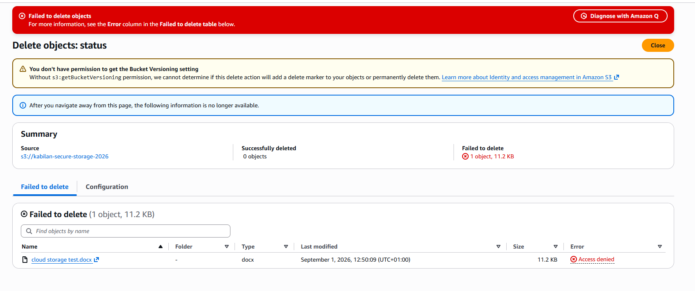

# Secure AWS S3 Storage with Least-Privilege IAM & CloudTrail Auditing

A hands-on AWS project demonstrating secure cloud storage practices: an S3 bucket
locked down with a custom least-privilege IAM policy, and CloudTrail enabled for
account-level audit logging.

## What this project demonstrates

- Creating an S3 bucket with public access blocked by default
- Writing a **custom IAM policy** that grants only the specific permissions needed
  (read, write, list) — deliberately excluding delete access
- Applying the principle of **least privilege**: an IAM user/group can only do what
  it's explicitly allowed to do, nothing more
- Enabling **CloudTrail** to log account activity for audit purposes
- Verifying the security setup actually works by testing an unauthorised action
  and confirming it's blocked

## Architecture

1. **S3 bucket** (`kabilan-secure-storage-2026`) — general purpose bucket, all public
   access blocked, server-side encryption (SSE-S3) enabled by default.
2. **IAM group** (`s3-project-users`) with a **custom policy** attached, scoped to
   this one bucket only:
   - `s3:GetObject` — allowed
   - `s3:PutObject` — allowed
   - `s3:ListBucket` — allowed
   - `s3:DeleteObject` — **not granted**
3. **CloudTrail** trail (`s3-project-audit-trail`) — multi-region, logging
   management events (account-level actions like bucket/policy/trail creation).

## Why these decisions

- **Least privilege over convenience**: rather than using the broad
  `AmazonS3FullAccess` managed policy, I wrote a custom policy scoped to exactly
  what the use case needed. This is standard practice in real environments —
  broad permissions are a common source of security incidents.
- **No delete permission**: this bucket is a storage location, not something a
  general user should be able to destroy data from. Leaving `DeleteObject` out
  of the policy is a deliberate, explainable choice.
- **Management events, not data events, in CloudTrail**: CloudTrail can log
  every single object-level action (data events) or just account-level actions
  (management events). Data event logging has an additional cost and is
  typically reserved for cases needing that level of granularity. For this
  project's scope, management-event logging strikes a reasonable balance
  between audit visibility and cost — a trade-off worth making consciously
  rather than defaulting to "log everything."
- **MFA on the root account**: the root user has unrestricted access to the
  whole AWS account, so securing it with MFA was one of the first steps, before
  any resources were created.

## Evidence: the policy actually works

To confirm the least-privilege policy was enforced (not just written), I logged
in as the restricted IAM user and attempted to delete an object from the bucket.

**Result: Access Denied.**

The IAM user could view and upload files as intended, but was correctly blocked
from deleting them — proving the policy's restrictions are actually enforced by
AWS, not just theoretical.

## Screenshots

| Step | Screenshot |
|---|---|
| S3 bucket created with public access blocked | `01-bucket-created.png` |
| Custom least-privilege IAM policy created | `02-iam-policy-created.png` |
| Policy attached to group (broad policy removed) | `03-policy-attached-to-group.png` |
| CloudTrail actively logging | `04-cloudtrail-logging-active.png` |
| Delete attempt correctly denied | `05-access-denied-evidence.png` |

## What I'd add next

- S3 data event logging, to capture object-level actions (like the exact
  `DeleteObject` denial) directly in CloudTrail, not just account-level events
- A Terraform configuration to provision this same setup as Infrastructure as
  Code, instead of manually through the console
- CloudWatch alarms on top of CloudTrail for real-time alerting on unauthorised
  access attempts

## Tools used

AWS S3, AWS IAM, AWS CloudTrail
